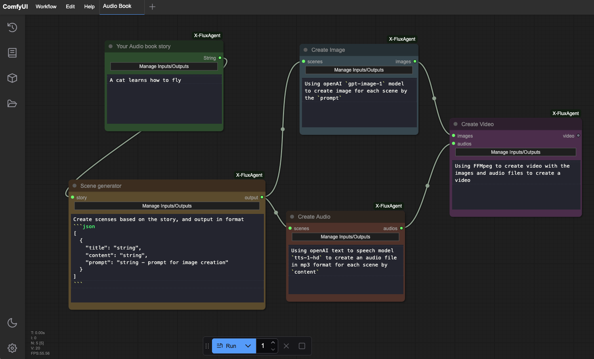
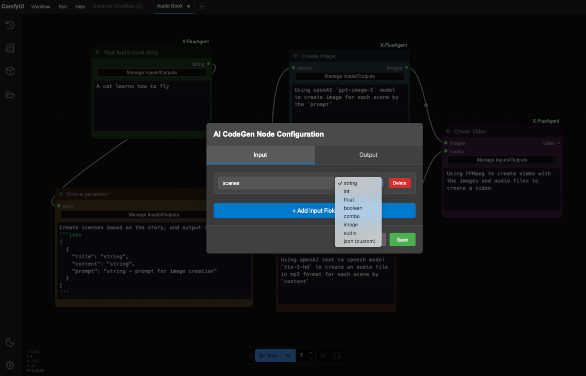

# 🚀 X-FluxAgent

[中文版](README_zh_CN.md)

> **Transform ComfyUI into a Universal AI Vibe Coding Agent — From Code to Productivity Automation**

**X-FluxAgent** turns ComfyUI into a smart, AI-powered agent capable of **building software**, **automating tasks**, and even **managing your daily workflows** — all with **natural language prompts**, no coding experience needed.

The **"X"** stands for **anything** — not just images and videos — but **code generation**, **automation**, **apps**, **agents**, and more.  
If you can think it, X-Comfy can flow it.

---

## How X-FluxAgent Works: Your Ideas to Reality in 4 Steps

X-FluxAgent simplifies turning your concepts into working applications or automated tasks. Here’s a straightforward look at the process:

#### Step 1: Describe Your Goal 📝

Simply tell X-FluxAgent what you want to create or automate. This could be anything from "build a tool to summarize articles" to "automate sending a welcome email to new subscribers." You define the project in natural language.

#### Step 2: Visualize the Plan (AI Creates a Workflow Diagram) 🗺️

Based on your description, X-FluxAgent automatically generates a visual workflow, similar to a UML diagram. This diagram shows each step (or "module") of your project, including what information goes in (inputs), what tasks each module performs (its "prompt"), and what comes out (outputs). You can review, update and understand the entire process at a glance.

Here’s an example of what this visual workflow might look like for an AI-powered audiobook generator:

(In this demo, you can see modules for the story input, scene generation, image creation, audio creation, and finally, video creation.)

(The system will automatically generate all necessary inputs, outputs, and connections for your workflow. However, you have the flexibility to make manual adjustments to these elements before proceeding to code generation.)

#### Step 3: AI Generates the Building Blocks (Code & Nodes) 🧱➡️💻

Once you're happy with the visual plan, X-FluxAgent gets to work. It translates each module in the workflow into the necessary code and creates the corresponding nodes within ComfyUI. You can then run this workflow just like any standard ComfyUI workflow, seeing your project come to life.

#### Step 4: Launch Your Creation (Export as a Standalone Project) 🚀

The magic doesn't stop in ComfyUI. X-FluxAgent allows you to export the entire workflow as a complete, standalone project. This means you can run your creation independently, without needing ComfyUI, making it easy to share or deploy your new tool or application.

---

## ✨ What It Does

- 🧠 **AI Agent from ComfyUI Nodes**  
  Use ComfyUI as a base to build your own AI-powered coding agent and automation tools, visually.

- 🧾 **Prompt-Based Node Creation**  
  Just describe what you want — new logic and nodes are generated by AI on demand.

- 💻 **Workflow → Real Code**  
  Export your ComfyUI workflows into full, standalone Python projects.  
  *(Support for C, C++, JavaScript coming soon.)*

- 🔁 **Beyond Coding**  
  Automate daily tasks like file processing, email sorting, task generation — all within an AI-enhanced workflow.

---

## ❓Why “X”?

| **X = Anything You Want**               |
|----------------------------------------|
| Build your own Coding Agent            |
| Automate boring daily tasks            |
| Turn ideas into working apps           |
| Design workflows without syntax        |
| Move from hobbyist to builder — fast   |

**You don’t need to be a coder to create powerful tools.**  
You just need ideas — X-Comfy takes care of the rest.

---

## ⚔️ UML vs AI Workflow: Old School vs AI Vibe

| Concept            | UML (Traditional Coding)         | AI Workflow (X-FluxAgent)     |
|--------------------|----------------------------------|----------------------------------------|
| Designer Role      | Software architect               | Anyone with an idea                    |
| Coding Skill Needed| High                             | None                                   |
| Tool               | Diagrams + Manual Code           | Visual Workflow + AI Coding Agent      |
| Output             | Plans or blueprints              | Running Code or Automation             |
| Update Process     | Redesign + re-code               | Just edit nodes or prompts             |
| Speed              | Slow and rigid                   | Fast, flexible, AI-enhanced            |

We're moving from **"plan first, code later"** to **"prompt, flow, deploy."**

---

## 🧠 Why Workflow-Based AI Coding?

Modern LLMs (like ChatGPT, Claude or Gemini) can write code — but they struggle with **large or unstructured codebases**. Here's why:

### 🔍 AI Is Great at Small Tasks, Not Whole Projects

- ✅ AI performs best when generating code under **~200 lines**.
- ⚠️ Larger tasks can lead to errors, hallucinations, or logic gaps.
- 🧠 Writing good code requires **clear structure, goals, and constraints**.

### 👁 Humans Understand Workflows Better Than Raw Code

- Large codebases are **hard to read, debug, and maintain**.
- Visual diagrams (like UML) help humans **see the big picture** quickly.
- Workflows in ComfyUI give us an interface to **design logic visually** — like drag-and-drop UML, but AI-powered.

---

## 🧩 How X-FluxAgent Solves This

We flip the process:

> 🔁 **You define the flow. AI defines the code.**

- Each **node** becomes a small unit: one function or class.
- You describe the node’s purpose using natural language.
- AI generates only what’s needed — **modular, readable code**.
- The full system is built node by node, just like a software architect would guide a dev team.

| Human Role           | AI Role                         |
|----------------------|----------------------------------|
| Design the workflow  | Write clean code per node        |
| Decide architecture  | Implement individual components  |
| Lead the process     | Execute each task step-by-step   |

This is not no-code.  
This is **co-code**: humans and AI building real software through **modular, guided workflows**.

---

## 🔋 Why ComfyUI as the Foundation?

While many AI workflow tools run entirely in the cloud, **ComfyUI stands out** because it:

- ✅ Runs **locally** on your machine using your **own GPU**
- ✅ Supports **custom nodes**, advanced pipelines, and full extensibility
- ✅ Is optimized for high-performance models like **Stable Diffusion, LLMs, AI Video tools**
- ✅ Gives full **transparency** and **control** over every node and connection

### 🧠 Our Belief: The Future is Local + Cloud GPU

We believe that:

- 🚀 Personal GPUs are becoming more powerful and affordable — everyone will soon have workstation-level AI power.
- ☁️ GPU Cloud platforms (like Lambda, Paperspace, RunPod, etc.) are easier than ever to deploy to.
- 🧩 ComfyUI is designed to support both — **local development + cloud deployment**.

### 🧬 How X-FluxAgent Leverages This

- Design your AI coding agent or task automation **visually in ComfyUI**
- Use your **local GPU to run it now**
- Or export the code to deploy in a **GPU cloud instance** with zero lock-in

Unlike other closed workflow tools, this is your code, your model, your GPU — **your way**.

---

## 🆚 ComfyUI vs Other AI Workflow Tools

| Feature                      | ComfyUI                  | Other Workflow Tools         |
|-----------------------------|---------------------------|------------------------------|
| Local GPU Support           | ✅ Yes                    | ❌ Cloud-only or limited     |
| Fully Open Source           | ✅ Yes                    | ⚠️ Often proprietary         |
| Custom Node Support         | ✅ Plug-and-play          | ⚠️ Limited or not available  |
| Exportable to Real Code     | ✅ With X-FluxAgent | ❌ Usually locked-in         |
| Ideal for LLMs & Diffusion  | ✅ Optimized              | ⚠️ Often limited to presets  |
| Transparent Data Flow       | ✅ Full visibility        | ❌ Abstracted or hidden      |

---

Absolutely! Here's the **updated "🛠 Use Cases"** section of your `README.md` with the new **sample workflows** integrated directly — making it clearer how powerful and versatile the project is.

## 🛠 Use Cases

Whether you're building tools, apps, content, or agents — **X-FluxAgent** turns your ideas into reality with the help of AI and modular workflows.

#### 🔧 General Use Cases

* Build real software projects in **Python**, and soon **C, C++, JavaScript**
* Create reusable **AI coding agents** and automation tools
* Automate business processes and personal productivity tasks
* Educate beginners using **Vibe Learning** — intuitive, big-picture learning with AI
* Prototype and ship projects **without writing boilerplate code**

#### 🎨 Creative & AI Media Workflows

* 🎧 **AI-Powered Audiobook Generation**
  Turn any written content into a professional audiobook using text-to-speech, character voices, and background music — all automated via workflow.

* 🎥 **YouTube Video Creation & Management**
  Scriptwriting → Voiceover → Thumbnail → Upload → Auto tags and title suggestions — manage the full video pipeline with AI.

* 🗣️ **Two-Host AI Anime Podcast Workflow**
  Generate podcast episodes using AI-generated characters, voices, synced subtitles, and animated visuals. Fully AI-driven and customizable.

* 🎬 **AI Anime Movie Creation Workflow**
  From plot design to dialogue, character animation, scene creation, and voice acting — orchestrate a full anime movie creation process using modular AI tools.

---

## 🎓 Learn by Vibe Coding + Vibe Learning

We're not just building — we're teaching you how to do it with **Vibe Learning**, a new methodology for the AGI era.

📖 Read the research paper:  
**[Vibe Learning – A Future Learning Methodology in the AGI Era](https://github.com/X-School-Academy/Vibe-Learning-Reseach)**

🎬 **YouTube Live Series**  
Watch us build this entire project live, using step-by-step Vibe Coding.  
🕘 **Live twice a week**: Tuesdays & Fridays, 9PM (Sydney/AU time)  
▶️ Playlist: https://www.youtube.com/playlist?list=PL1rSmofNjIRH4rJq8tzA8a7gd6USySR4g  
📌 **Subscribe to the Channel** for updates!

💬 **Join Our Discord Community**  
Ask questions, share ideas, contribute to the project.  
🧠 Discord: [https://juniorit.ai/virtual-office](https://juniorit.ai/virtual-office)

---

## 📦 Installation

> Coming soon

To install:
1. Clone this repo
2. Place it in your ComfyUI `custom_nodes/` directory
3. Restart ComfyUI
4. Start building your next AI-powered workflow

---

## 📄 License

This project is licensed under the **GNU Affero General Public License v3.0 (AGPL-3.0)**.  
See the [LICENSE](./LICENSE) file for full details.

---

## 🤝 Contribute and Join the Movement

We welcome contributors of all backgrounds — no coding experience required.

> By contributing, you agree to assign copyright
> of your work to the project owner  
> so it can be used for any purpose, including commercial use.  
> See [CONTRIBUTION_TERM.md](./CONTRIBUTION_TERM.md)

---

## 🔭 Roadmap

#### 🚧 Phase 1: Core Foundation

* [ ] Initialize the project structure and X-FluxAgent framework
* [ ] Build the first **LLM Node** (prompt in, response out)
* [ ] Add **CodeMirror Node** for in-node code viewing and editing

#### 🧠 Phase 2: Python Workflow Support

* [ ] Enable LLM nodes to create new functional nodes via prompt (Python)
* [ ] Export ComfyUI workflows as full **Python projects**

---

#### 🎨 Sample AI Workflows

> Real-world use cases that demonstrate the power of X-FluxAgent

* [ ] **AI-Powered Audiobook Generation Workflow**
  Convert text into professional audiobooks using TTS and NLP nodes.

* [ ] **YouTube Video Creation & Management Workflow**
  Script → Voiceover → Thumbnail → Upload → AI title & tag generator.

* [ ] **Two-Host AI Anime Podcast Video Workflow**
  Auto-generate podcast episodes with AI voices, avatars, and synced subtitles.

* [ ] **AI Anime Movie Creation Workflow**
  From storyline + character design to scene-by-scene generation using AI.

---

#### 🌐 Phase 3: Multi-language Expansion

* [ ] Extend LLM node to support **C, C++, JavaScript** code generation
* [ ] Enable workflow export to **C, C++, JavaScript** projects

#### 📱 Phase 4: UI & App Generation

* [ ] Add nodes for **Web & Mobile UI components**
* [ ] Export workflows as **Web & Mobile Applications**

#### 🔮 Phase 5: AI-Powered Developer Tools

* [ ] Integrate **AI Prompt Helper** for guided task generation
* [ ] Add **Node-to-CLI Converters** (generate terminal tools)
* [ ] Implement **Visual Debugging** and **Live AI Feedback**

#### 🤝 Phase 6: Collaboration & Ecosystem

* [ ] Enable **multi-user workflow collaboration**
* [ ] Add **project sharing**, **import/export**, and **community node templates**

---

## 🌟 Join the AI Coding Revolution

**No-code? Low-code? Forget labels.**  
This is **vibe-code** — a new way to create with AI, for creators, coders, and visionaries.

🎨 Artists  
👩‍🏫 Educators  
🧠 Engineers  
💼 Office workers  
💡 Dreamers

If you can imagine it, X-Comfy can help you build it.

> ⭐ Star this project to support the future of visual AI coding.
